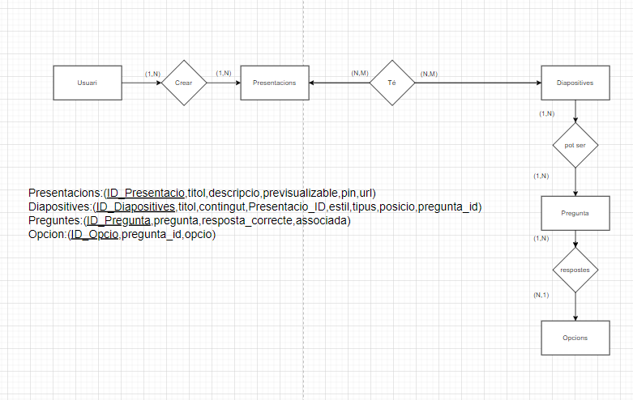

//:escriptor:
:toc-title: Taula de continguts
:figure-caption: Figura
:table-caption: Taula
:example-caption: Exemple
:author: Brian Arrua, Adrian Bernabeu, Nil arilla,Ruben tabasco
:revdate: Octubre 9, 2023
:doctype: book
:encoding: utf-8
:lang: ca
:toc: left
:toclevels: 3
:icons: font

= Projecte Slides

== Introducció

=== Membres de l'equip
* [underline]#Adrian Bernabeu#
** Imaginatiu, treballador i aplicat,
* [underline]#Brian Arrua#
** Productiu, estudiós i perseverant.
* [underline]#Nil Arilla#
** Optimisma, confiable i actiu.
* [underline]#Ruben Tabasco#
** Colaboratiu, creatiu, treballador i optimista.

=== Objectiu de l'aplicacio
L'aplicació web està destinada a persones que vulguin transmetre coneixements mitjançant presentacions.

== Tasques a realitzar

=== Setmana 1 (9-11 d'octubre):
A la primera setmana vam distribuir-nos les diferents tasques del primer sprint entre els 4 membres de grup. Vam crear el Trello, on vam assignar les tasques, vam fer els sketchs (a mà) i els mockups (amb l'aplicació 'moqups') de les diferents pantalles, i vam crear el fitxer vagrant i el vam connectar amb la base de dades. També vam crear tres carpetes principals (Codi, Documentacio, BaseDeDades), on anirien distribuides els diferents fitxers.

=== Setmana 2 (16-20 d'octubre):
A la primera setmana haviem entès malament el primer sprint (pensavem que no s'havia de tocar codi), per tant, aquesta ens ha tocat avançar molt més del que realment hauriem d'haver avançat. Hem acabat els layouts de les pantalles i hem acabat també el seu codimJavaScript. També hem hagut de tornar a fer els mockups amb Figma, que era l'aplicació que es recomanava a l'enunciat del projecte. Ademés, com haviem organitzat les subcarpetes de la carpeta Codi per pantalles, hem hagut de reorganitzar-les per cada tipus de fitxer a la seva carpeta.
Vam aconseguir fer la connexió entre la base de dades i el php. Després, tot i que teniem a mitges la pantalla de crear presentacions, vam acabar la pàgina home. Amb l'ajut d'un fitxer auxiliar (prova.php), vam poder comprovar que funcionava. L'últim dia va ser la revisió, i vam fer les modificacions que s'ens va demanar.  

=== Setmana 3 (23-27 d'octubre):
Al dilluns 23, gairebé vam acabar la pàgina de presentacions, només ens va faltar arreglar un error que teniem a l'hora de fer insercions a la taula de les diapositives de la base de dades. També, vam actualitzar el Figma, degut a que estavem utilitzant un disseny antic. El dijous, vam acabar del tot l'sprint 1 i la funció d'esborrar de l'sprint 2. També, hem començat a afegir al Figma les pantalles que s'han de crear al segon sprint.

=== Setmana 4 (30-3 d'octubre/novembre):
Al dilluns 30, vam actualitzar gairebé tots els aspectes a millorar que ens havien esmentat al seguimen del projecte, tant els nous, com els de la valoració passada. També, hem acabat la funcionalitat de la funció de previsualització dels estils, però només ens falta estilitzar-lo. Al dimarts 31, vam reorganitzar les carpetes on teniem els fitxers, vam acabar la funcionalitat de previualització d'estils i vam posar subtasques a les tasques del trello. També hem actualitzat errors que teniem al codi.

== Disseny base de dades

**Aquest es el diagrama que fem us per tot el projecte**

=== Explicació de les taules
** [underline]#Usuari:# Aquesta taula és més abstracte, ja que el seu funcionament és especificar que l'usuari pot crear diferents presentacions
** [underline]#Presentacions:# Aquesta taula és la principal consta de l'ID_Presentacio és una id autoincrement que va creixent cada vegada que crees una Presentació, el títol que es el nom de la presentació, la descripció de la presentació, la columna previsualizable es la columna on tu pots escollir si vols que sigui previsualitza ble o no, el pin de la presentació si vols que tingui un, url és l'URL que et donem quan u públiques.
** [underline]#Diapositives:# La taula de diapositives és una taula on que pot tenir diferents tipus i els seus atributs són el nom (és el primary key), el títol i el contingut, la presentació a la qual està associada, la columna, estil és l'estil que vols escollir per les diapositives, les columnes de posició és per quant tu vols canviar les posicions, el tipus és si té contingut o si és una diapositiva de preguntes i la pregunta_Id és la columna et connecta amb la pregunta que has creat Sin és de tipus preguntes.
** [underline]#Preguntes:# La taula de preguntes té tota la pregunta completa,l'opció correcta.
** [underline]#Opcions:# La taula d'Opcions són les respostes a les preguntes que estan connectades.

== Sketching i Mockup d'interficies

include::pantalles.adoc[]

== La guia d'estil
**Hem escollt la paleta de colors del color morad, perquè és un color que s'associa amb la ceativitat i la imaginació**

include::guiaEstils.adoc[]

=== [underline]#mapa de navegació:# 

== Confecció del manual d’instal·lació i distribució de l’aplicació

include::manualInstalacio.adoc[]

== Planificació. Desviacions en la planificació.

Des del principi del projecte no hem fet cap canvi gran, ja que les coses noves que havíem de fer només era afegir noves funcionalitats i en cap moment hem esborrat una funcionalitat.
L'únic canvi que hem fet en tot el projecta va ser la creació o la modificació de la base de dades.

== Confecció del manual d’usuari integrat a l’aplicació
include::manualUsuari.adoc[]

== Línies futures
Per les Línies futures hem pensat de posar les coses que ens ha faltat posar i millorar les coses com l'estil que no ens agrada totalment, també millorar les funcionalitats que n'hi ha algunes que funcionen, però podrien estar millor i bé posat, també Organitzar millor les codes perquè es pugui entendre millor.
== Conclusions
** [underline]#Adrian Bernabeu:# En aquest projecte he millorat la comunicacio en equip, ja que com treballabem en una unica rama en el git teniem que tenir bona comunicacio per no anant treballant en el mateix fitxer i també he aprés a treballar amb el PHP enviant dades a una base de dades i rebra de la base de dades el que es necesitaba, amb el JAVASCRIPT ha organitzar millor el codi i comentar-ho per a que els membres de l'equip sapiguen el que fa, per al HTML/CSS el que he apres a sigut fer les pagines responsives 

** [underline]#Nil Arilla:# Aquest projecte m’ha ensenyat moltes coses que potser d’una manera d’estudi més tradicional no hauria après. Com per exemple, a autoorganitzar-se dins d’un equip de treball.

** [underline]#Brian Arrua:# En aquest projecte he fet diferents llenguatges de programació que no havia tocat mai, per exemple JavaScript només l'he tocat aquest any en els exercicis i en el projecte i igual amb PHP i com no baix tocar molta he après molt d'aquests llenguatges i m'agradaria tocar molt, ja que el poc que he tocat perquè és el primer projecte em va agradar molt, amb CSS i HTML és diferent, perquè ja el baix utilitzar molt en Smix i fer ús d'aquests dos llenguatge altra vegada en va fer torna recordar avanç, perquè no em recordava de molt també el que he après en aquest projecta va ser la comunicació, organització i el bon ambient amb els membres del grup que ha estat molt bé els temps que he passat amb ells i em va agradar molt.

== Webgrafia
** [underline]#PHP Manual:#  https://www.php.net/manual/es/index.php
** [underline]#JavaScript:#  https://developer.mozilla.org/en-US/docs/Learn/JavaScript

** [underline]#Manual Institut BD:#  https://quejox.gitlab.io/materialsweb/curs23_24/daw_m03uf6programacio/apunts.html
** [underline]#Manual Institut JavasCript:#  https://jbosom.gitlab.io/apuntspublics/Manuals/JavaScript/ManualJavaScript.html

== Presentació del projecte

** [underline]#Video:#  https://drive.google.com/file/d/1rdmE7jN3MACWpTLuFeXSiJTc0RejablI/view?usp=sharing