=== La paleta de colors que utilitzarem serà aquesta

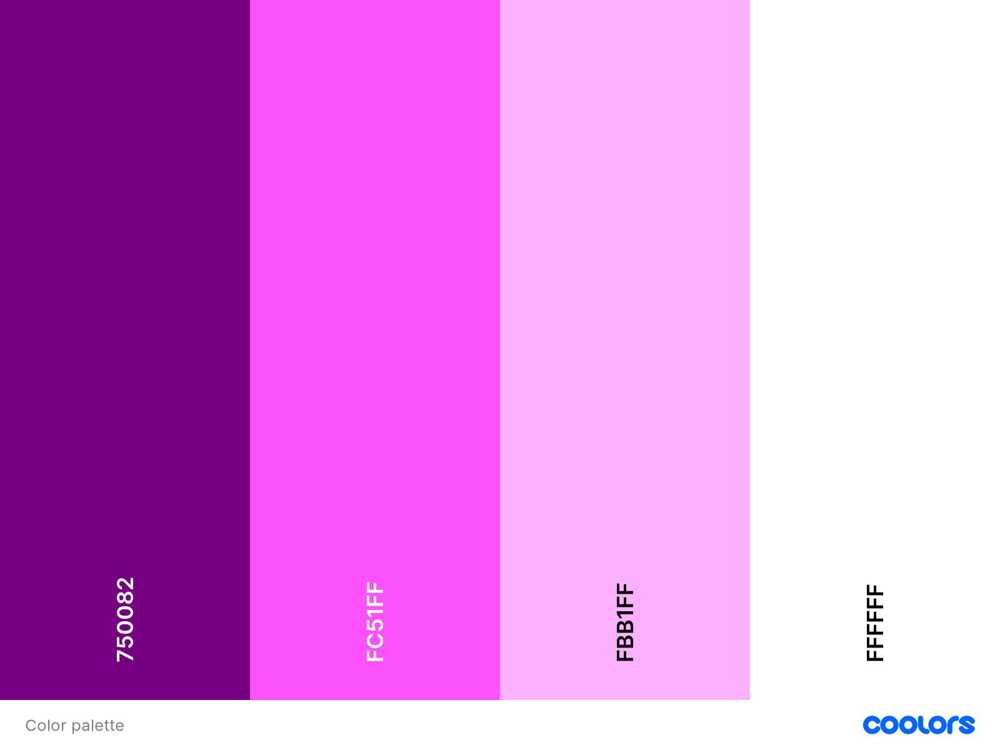

=== [underline]#Tipografia:#
==== Com a tipografia utiltzarem la "Nunito"
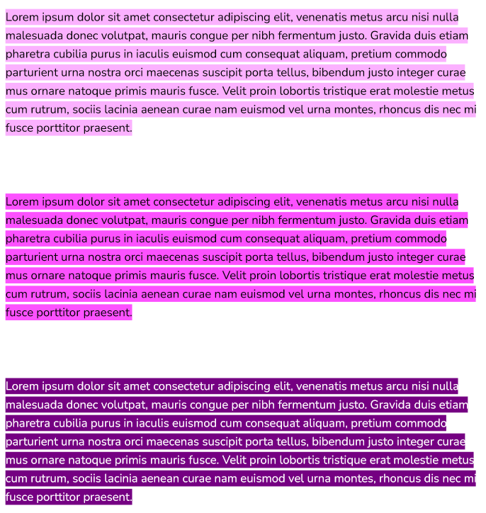

=== [underline]#Contraste:#

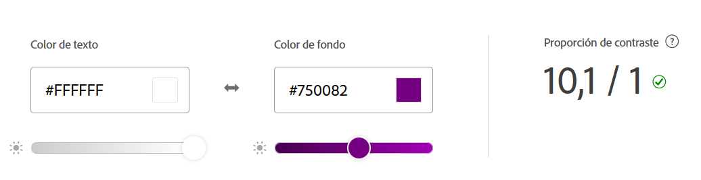

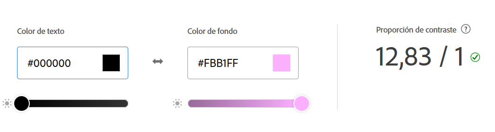

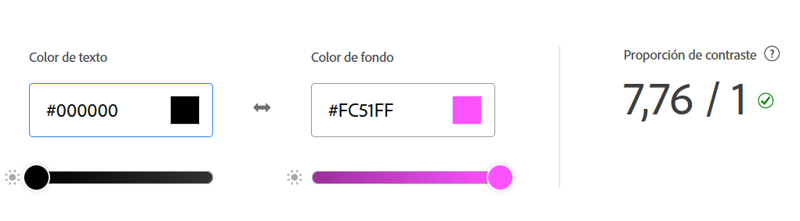

== Paleta de colors dels diferents estils aplicables a la presentació

== Estil 1: DARK

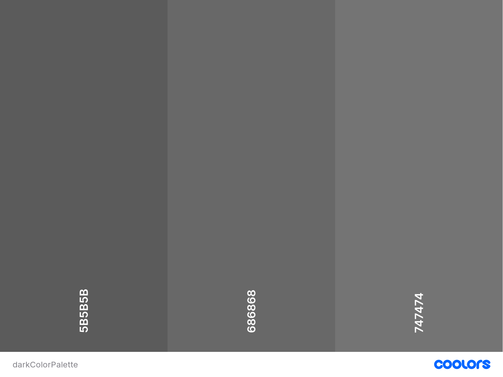

.Contrast d'aquesta

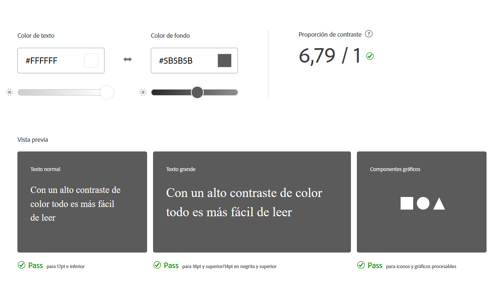

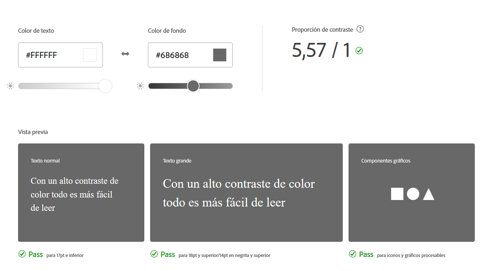

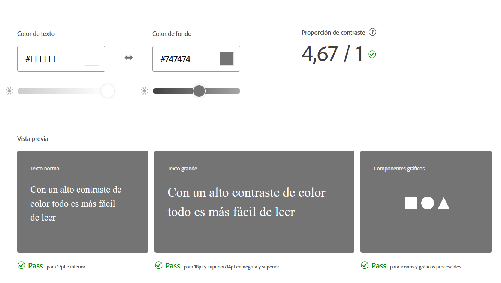

== Estil 2: SNOW

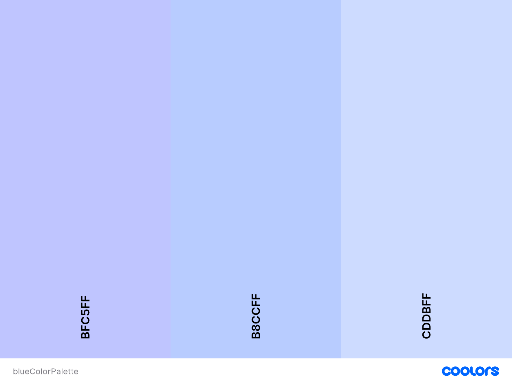

.Contrast d'aquesta

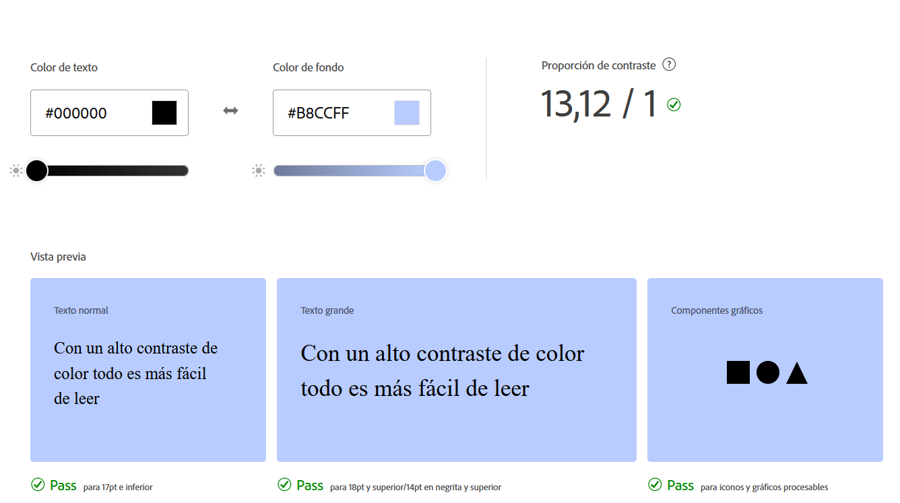

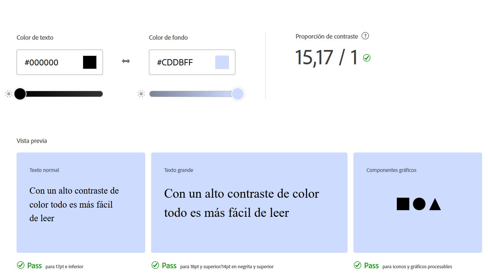

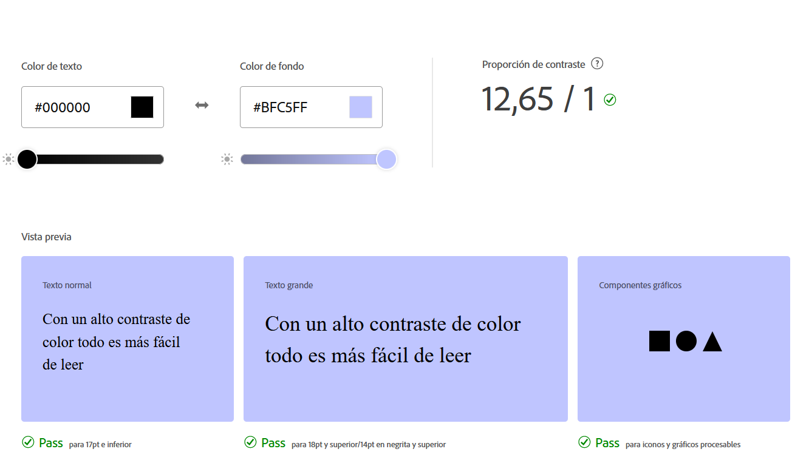

=== Icones:
==== Cada cop que el ratolí passi per sobre d'una icona s'activarà un efecte hover que augmentarà el seu tamany en una escala de 1.1:1;
.Utilitzarem aquest icona per anar a la pàgina home cada cop que sigui clickada;

.Per esborrar una presentació que ya ha estat creada;

.Serveix per editar la presentació i les seves diapositives;

.Permet copiar la presentació amb les seves diapositives;

.Permet veure una vista previa de com queda la presentació;

.Permet afegir una nova diapositiva 

.Permet baixar una posicio de la diapositiva

.Permet pujar una posicio de la diapositiva

=== Botons:
==== Cada cop que el ratolí passi per sobre d'un botó, s'activarà un efecte hover que farà un canvi de color en aquest;
.Aquest botó permet crear més presentacions;

.Després de fer tots els canvis a les diapositives, el que farà el botó és guardar la presentació;
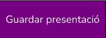
.Permet publicar la presentacio

.Permet despublicar la presentacio

.Quan esta publicada la presentacio sortira aquest boto que posara la URL de la presentacio

.Permet veure les altres diapositives dintre de la vista client 
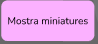
.Permet acabar la visualitzacio 
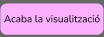
.Permet previsualitzar la presentacio
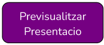
.Permet previsualitzar la diapositiva
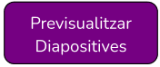

