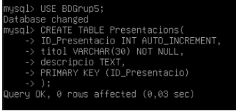
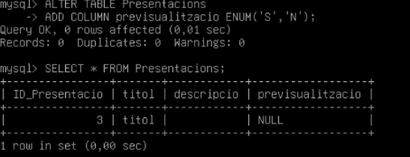
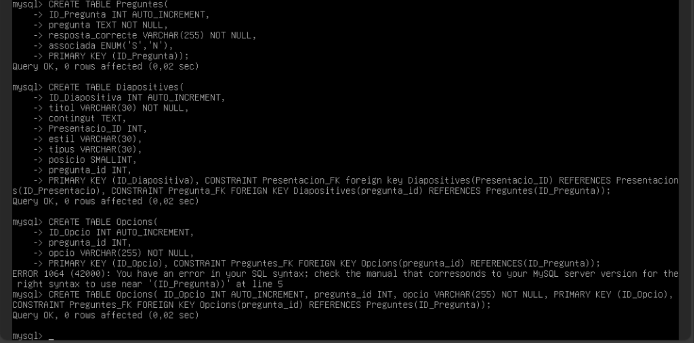
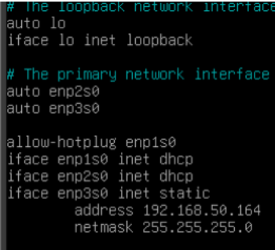

== Isard
**En aquest document estara les comandes que haurem de fer servir per fer servir el el issar amb la base de dades posat.**

** Per poder fer el update tindrem que posar el següent comanda per tenir connexio
	**** sudo dhclient 
** La primera comanda a de ser la autalizacio del debian.
  **** sudo apt-get update
** Instalar el mysql
  **** sudo apt-get install -y mysql-server 

  **** wget https://dev.mysql.com/get/mysql-apt-config_0.8.26-1_all.deb

  **** sudo apt install gnupg

  **** sudo dpkg -i mysql-apt-config_0.8.26-1_all.deb

  **** sudo apt-get update

  **** sudo apt install -y mysql-server, li posarem de contraseña root

  **** Entrem amb sudo al mysql i tindrem que crear el usuari Admin i tindrà tambe la contraseña admin posant les següents comandes: 
    ***** sudo mysql -u root -p
    ***** CREATE USER ‘Admin’ IDENTIFIED BY ‘admin’;
    ***** GRANT ALL PRIVILEGES ON *.* TO ‘Admin’
    ***** Tindrem que crear la base de dades 
    ***** CREATE DATABASE BDGrup5
    ***** Tambe tindrem que crear les taules

** Instalar GIT
  **** Per instalar el git tindrem que posat el comanda
    ***** sudo apt install git
  **** Després tindrem que clonar el nostre repositori git a la ruta /var/www/html
    ***** cd /var/www/html
    ***** sudo git clone https://git.copernic.cat/arrua.dominguez.brian.tobias/projecte-slides.git
    ***** Tindrem que posar un nom d’usuari del git amb la seva contraseña
    ***** Tambe tindrem que posar un comanda per configurar-lo:
    ***** sudo git config –global –add safe.directory /var/www/html/projecte-slides

** Errors PHP
  **** Primer tindrem que buscar l’ubicacio del fitxer php.ini, utilitzarem el següent comanda per trobar-lo 
php -i | grep “Loaded Configuration File
  **** Una vegada trobat l’editarem amb el nano el fitxer php.ini per poder mostrar els errors PHP per pantalla, tindrem que editar les següents línies:
    ***** El display_errors per predeterminat esta en off, el tindrem que posar en on
    ***** També el display_startup_errors, el tindrem que posar en on
    ***** Després tindrem que reiniciar el servei fent service apache2 restart
 
** Configuració xarxa

  **** Per configurar la IP tindrem que editar el fitxer /etc/network/interfaces i posar el següent: 

  **** Després per reiniciar el fitxer tindrem que posar el següent comanda:
sudo /etc/init.d/networking restart
  **** Per saber si ho hem fet bé podem fer-ho fent un status, si surt que esta active en principi tot esta bé, el comanda per comprovar-ho és el següent:  
    ***** systemctl status networking.service 
  **** Si després reiniciem la màquina podrem veure que s’han aplicat les ip’s

** Configuració pàgina
  **** Primer el que tindrem que fer sera entrar a la ruta /var/www/html i canviarem el nom del index.html per index.php, després tindrem que activar el php amb l’ip i el port utilitzant el següent codi:
    ***** php -S 192.168.50.164:8000

  **** Després tindrem que fer que el index.php es redireccioni al homeVista.php del projecte posant el següent comanda:
    ***** header(“Location: projecte-slides\\Code\\PHP\\index.php”)
