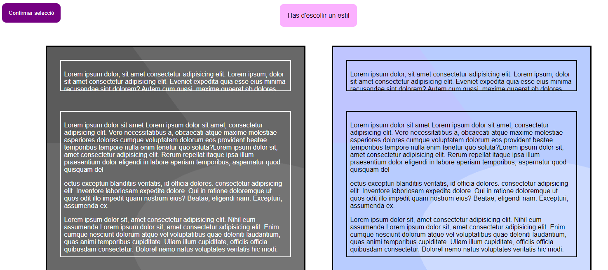
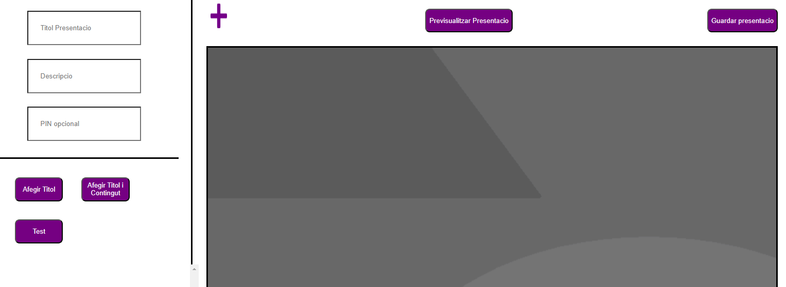
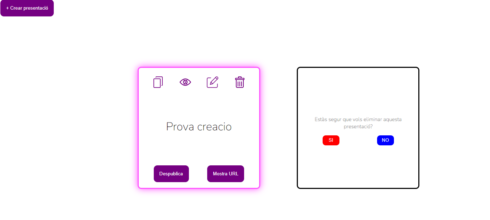
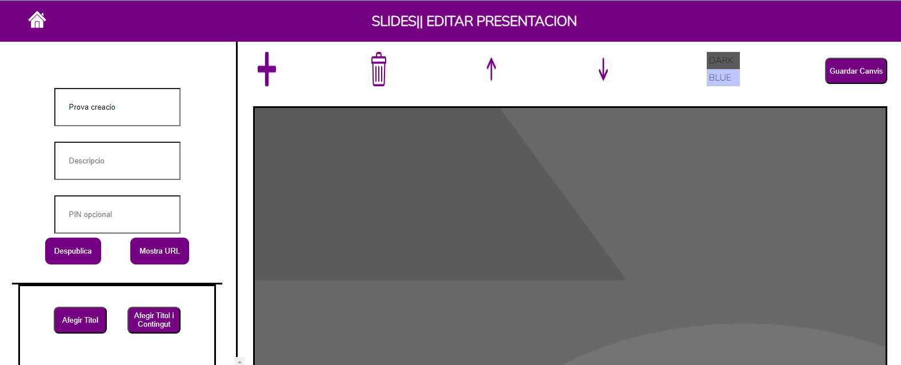

== Manual Usuaris
**En aquest document estarà l'opció que pot escollir l'usuari.**

** La pàgina ens permetré crear Presentacions donant-li a crear presentació:
** Després et sortirà la pàgina d'Estils que pots escollir entre aquest dos i no et deixa avançar si no has escollit una opció.

** En la pagina de creacio de les presentacións:

  **** Pots posar el títol, la descripció i el pin.
  **** Botó d'afegir títol et permetré omplir una diapositiva de només títol
  **** Botó d'afegir títol i contingut et permetré omplir una diapositiva on pots posar títol i contingut
  **** Botó d'afegir test et permetré omplir una diapositiva d'on pots posar preguntes i les diferents opcions i també la resposta correcta.
  **** Botó de més et permetré afegir una diapositiva nova creada
  **** Botó de previsualitzar presentació et permetré veure com va quedar la presentació abans de crear-lo
  **** Botó guardar presentació et permetré guardar tota la presentació amb les diapositives posades

** Pàgina d'Home Després de la creació d'una Presentació

  **** Botó d'ULL si el donés pots dir si vols que es previsualitzi o no
  **** Botó de pública et permetré publicar i et sortirà dues opcions més després que són:
   ***** Despublica per despublicar la presentació
   ***** Mostra URL que et donarà l'URL de la presentació
** El botó de la paperera et permetré esborrar la presentació amb les diapositives dintre
  **** També et demanarà si està segur d'aquesta opció i et sortirà un:
    ***** NO
    ***** SI
** Editar presentacio:

  *** En aquesta pàgina pots fer les mateixes opcions que la de crear, però amb aquestes diferències.
  **** Pots eliminar una diapositiva amb la paperera.
  **** Et permetré canviar la posició d'una diapositiva sigui pujar una diapositiva o baixar-la.
  **** Et permetré canviar l'estil de les diapositives